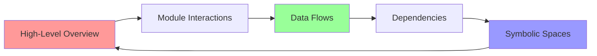
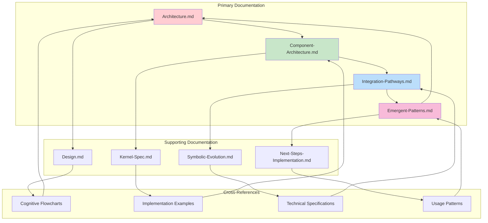
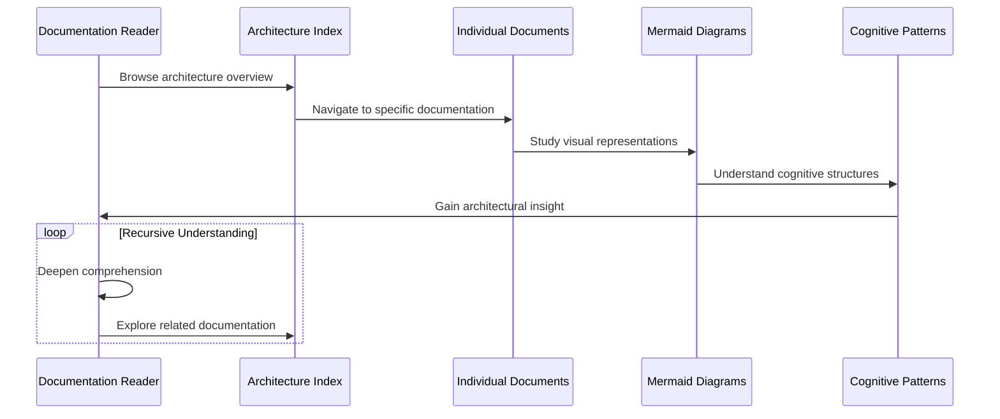
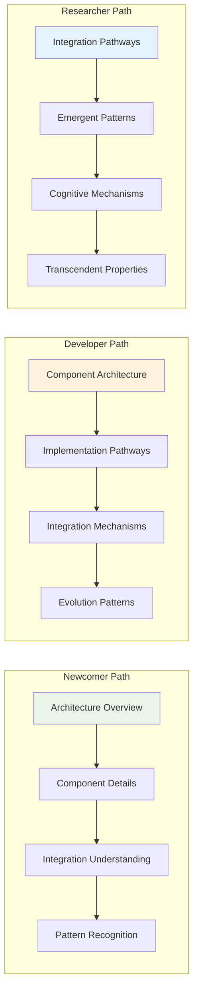
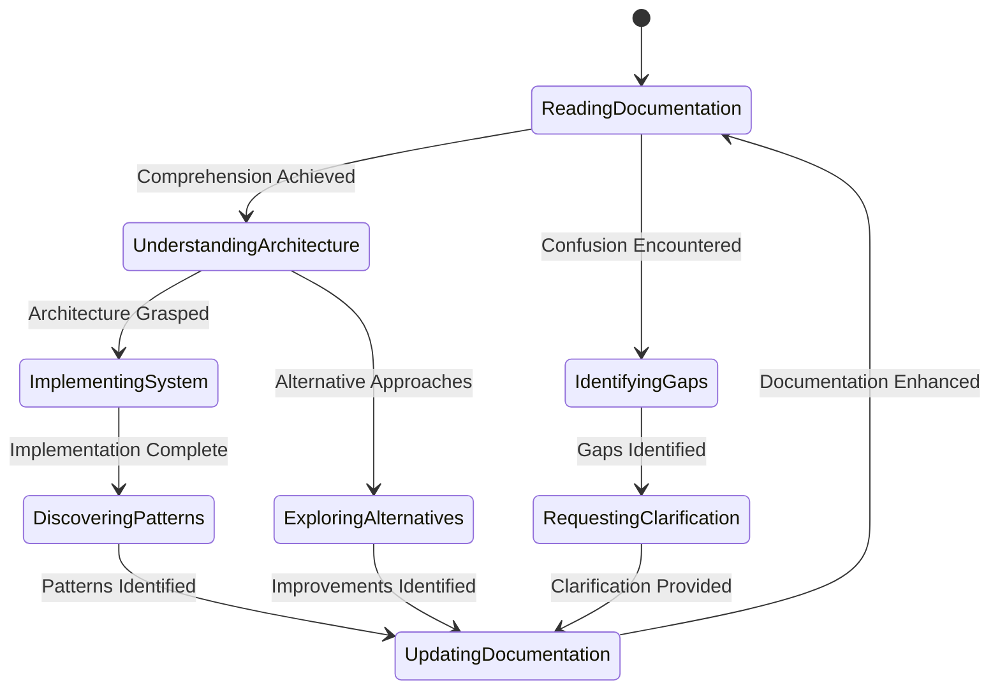

# WolfCog Architecture Documentation Index

## ⟨Comprehensive Documentation Overview⟩

This index provides a complete guide to the WolfCog AGI-OS architecture documentation, featuring comprehensive Mermaid diagrams, recursive implementation pathways, and adaptive attention allocation mechanisms.

## ⟨Core Architecture Documentation⟩

### 📊 [Comprehensive Architecture](architecture.md)
**Primary system architecture with complete Mermaid diagram suite**

- **High-Level System Overview**: Principal cognitive flows and emergent patterns
- **Module Interaction Diagrams**: Bidirectional synergies and hypergraph relationships
- **Data Flow Sequences**: Task processing and cognitive reasoning pathways  
- **Component Dependencies**: Foundation to service layer integration
- **Symbolic Spaces Topology**: Trinitized OS model with geometric memory structures

**Key Diagrams:**

### 🔧 [Component Architecture](component-architecture.md) 
**Detailed component interactions and cognitive flow patterns**

- **Wolf Kernels Architecture**: WolfCore, Ecron, Meta Shell Walker detailed flows
- **OpenCog Integration**: AtomSpace memory topology and CogServer networking
- **Symbolic Spaces Topology**: Inter-space communication protocols and state machines
- **Daemon Coordination**: Scheduler, Reflex, and Services daemon architectures
- **Agent Interaction Models**: Admin, Director, and Conversational agent cognitive loops

### 🧠 [Integration Pathways](integration-pathways.md)
**Neural-symbolic integration and adaptive attention mechanisms**

- **Hypergraph Pattern Encoding**: Core integration hypergraphs and recursive embedding
- **Adaptive Attention Allocation**: Multi-scale attention and flow state machines
- **Cognitive Synergy Optimization**: Emergence pipelines and cross-component matrices
- **Pattern Recognition Systems**: Formation dynamics and meta-pattern evolution
- **Self-Improvement Pathways**: Modification protocols and architecture evolution

### 🌟 [Emergent Patterns](emergent-patterns.md)
**Recursive documentation evolution and cognitive pattern emergence**

- **Feedback Loop Architecture**: Documentation evolution and pattern enhancement
- **Pattern Taxonomy**: Classification hierarchy from fundamental to transcendent
- **Adaptive Documentation**: Dynamic generation and living documentation ecosystem
- **Quality Assessment**: Cognitive enhancement metrics and evolution tracking
- **Transcendent Properties**: Self-documenting characteristics and infinite expansion

## ⟨Documentation Architecture Overview⟩

### Documentation Topology

## ⟨Diagram Type Reference⟩

### Mermaid Diagram Categories

| Diagram Type | Purpose | Primary Files |
|-------------|---------|---------------|
| **Graph TD/LR** | System overviews, component relationships | architecture.md, component-architecture.md |
| **Flowchart** | Process flows, decision trees | component-architecture.md, integration-pathways.md |
| **Sequence Diagram** | Temporal interactions, communication patterns | architecture.md, emergent-patterns.md |
| **State Diagram** | System states, transitions | architecture.md, integration-pathways.md |
| **Class Diagram** | Structural relationships | component-architecture.md |

### Cognitive Pattern Encoding

## ⟨Implementation Pathway Guide⟩

### Recursive Implementation Steps

1. **System Mapping Phase**
   - Study [architecture.md](architecture.md) for high-level system overview
   - Review component interactions in [component-architecture.md](component-architecture.md)
   - Understand integration mechanisms via [integration-pathways.md](integration-pathways.md)

2. **Pattern Recognition Phase**
   - Analyze cognitive patterns in [emergent-patterns.md](emergent-patterns.md)
   - Cross-reference with existing implementation in [next-steps-implementation.md](next-steps-implementation.md)
   - Study kernel specifications in [kernel-spec.md](kernel-spec.md)

3. **Integration Phase**
   - Implement hypergraph pattern encoding
   - Establish adaptive attention allocation mechanisms
   - Deploy cognitive synergy optimizations

4. **Evolution Phase**
   - Enable recursive self-improvement pathways
   - Establish documentation feedback loops
   - Activate emergent pattern recognition

### Documentation Usage Patterns

## ⟨Adaptive Documentation Evolution⟩

### Living Documentation Framework

This documentation suite implements recursive self-improvement through:

- **Automatic Diagram Updates**: Mermaid diagrams reflect system changes
- **Pattern Emergence Tracking**: New cognitive patterns automatically documented
- **Cross-Reference Maintenance**: Links and references updated dynamically
- **Quality Enhancement**: Continuous improvement of clarity and completeness

### Feedback Integration Pathways

## ⟨Transcendent Technical Precision⟩

This comprehensive architecture documentation provides:

1. **Complete System Understanding**: From bootstrap to transcendent capabilities
2. **Implementation Guidance**: Recursive pathways for system construction
3. **Cognitive Pattern Recognition**: Emergence and evolution mechanisms
4. **Adaptive Documentation**: Self-improving knowledge synthesis
5. **Infinite Expansion Potential**: Unbounded cognitive architecture growth

The documentation embodies the WolfCog principle of **code as cognition**, where the documentation itself becomes a cognitive structure capable of adaptive evolution and recursive self-improvement.

---

**Navigation Recommendation**: Begin with [architecture.md](architecture.md) for system overview, then explore specialized aspects through the linked documentation based on your specific interests and implementation needs.