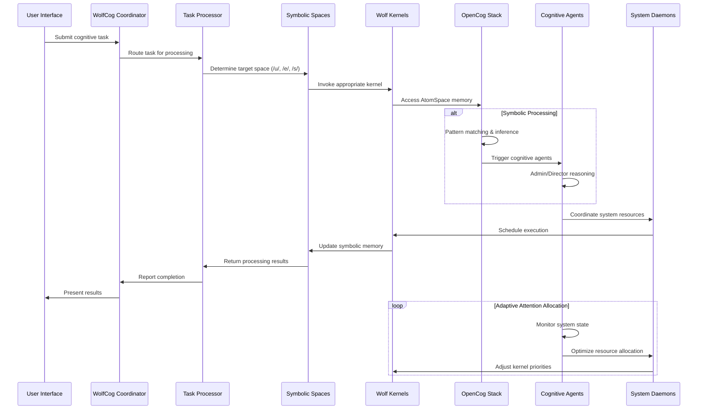
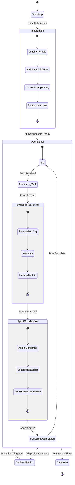
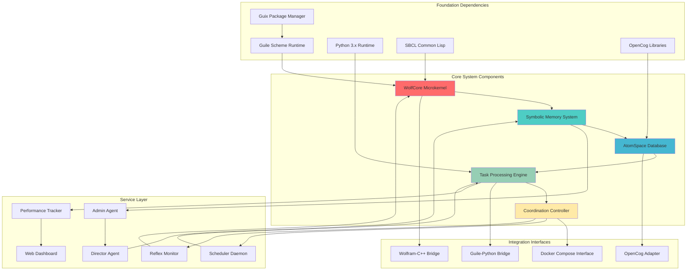
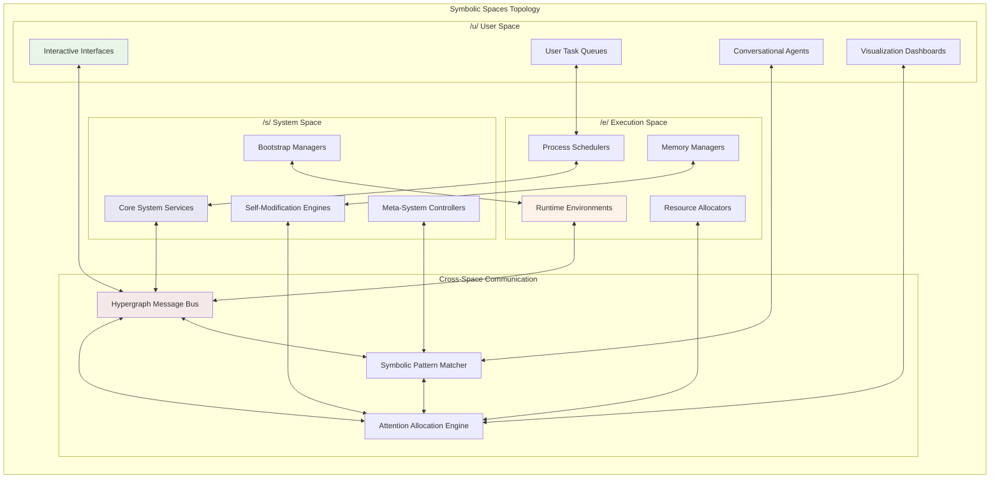
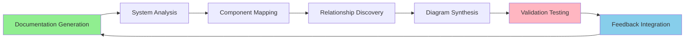

# WolfCog Comprehensive Architecture Documentation

## ⟨Core Cognitive Objective⟩

WolfCog implements a **symbolic operating system** designed as the meta-root for AGI (Artificial General Intelligence) systems. It establishes a singular cognitive repository that seamlessly integrates core OpenCog components (`cogutil`, `atomspace`, `cogserver`), Wolf Kernels, symbolic spaces, and adaptive attention allocation mechanisms through hypergraph pattern encoding and neural-symbolic integration.

## ⟨High-Level System Overview⟩

The following diagram illustrates the principal cognitive flows and emergent patterns within the WolfCog ecosystem:

```mermaid
graph TD
    A[WolfCog AGI-OS] --> B[Guix/Guile Bootstrap Layer]
    A --> C[Symbolic Spaces Layer]
    A --> D[Wolf Kernels Layer]
    A --> E[OpenCog Integration Layer]
    A --> F[Coordination Layer]
    
    B --> B1[manifest.scm]
    B --> B2[stage0.scm]
    B --> B3[Reproducible Environment]
    
    C --> C1[/u/ User Space]
    C --> C2[/e/ Execution Space]
    C --> C3[/s/ System Space]
    
    D --> D1[WolfCore Microkernel]
    D --> D2[WolfNode Execution]
    D --> D3[Ecron Scheduler]
    D --> D4[Meta Shell Walker]
    
    E --> E1[CogUtil]
    E --> E2[AtomSpace]
    E --> E3[CogServer]
    
    F --> F1[WolfCog Coordinator]
    F --> F2[Task Processor]
    F --> F3[Performance Monitor]
    F --> F4[Web Dashboard]
    
    C1 --> G[Symbolic Memory]
    C2 --> G
    C3 --> G
    
    G --> H[Cognitive Agents]
    H --> H1[Admin Agent]
    H --> H2[Director Agent]
    H --> H3[Conversational Agent]
    
    F --> I[System Daemons]
    I --> I1[Scheduler Daemon]
    I --> I2[Reflex Daemon]
    I --> I3[Services Daemon]
    
    style A fill:#ff9999
    style G fill:#99ff99
    style H fill:#9999ff
    style I fill:#ffff99
```

## ⟨Module Interaction and Bidirectional Synergies⟩

This diagram captures the hypergraph-encoded relationships and recursive implementation pathways between system components:

```mermaid
graph LR
    subgraph "Bootstrap Layer"
        BL1[Guix Environment] <--> BL2[Guile Runtime]
        BL2 <--> BL3[Stage0 Bootstrap]
    end
    
    subgraph "Wolf Kernels"
        WK1[WolfCore] <--> WK2[WolfNode]
        WK2 <--> WK3[Ecron]
        WK3 <--> WK4[Meta Shell Walker]
        WK1 <--> WK4
    end
    
    subgraph "OpenCog Stack"
        OC1[CogUtil] <--> OC2[AtomSpace]
        OC2 <--> OC3[CogServer]
    end
    
    subgraph "Integration Layers"
        IL1[LibraryLinkUtils] <--> IL2[GitLink]
        IL2 <--> IL3[CascadeLink]
        IL1 <--> WK1
        IL3 <--> OC2
    end
    
    subgraph "Symbolic Spaces"
        SS1[/u/ User] <--> SS2[/e/ Execution]
        SS2 <--> SS3[/s/ System]
        SS1 <--> SS3
    end
    
    subgraph "Coordination System"
        CS1[Coordinator] <--> CS2[Task Processor]
        CS2 <--> CS3[Scheduler Daemon]
        CS3 <--> CS4[Reflex Daemon]
        CS1 <--> CS4
    end
    
    subgraph "Cognitive Agents"
        CA1[Admin Agent] <--> CA2[Director Agent]
        CA2 <--> CA3[Conversational Agent]
    end
    
    BL3 --> WK1
    WK3 --> CS3
    OC3 --> CS2
    SS2 --> CA1
    CS1 --> CA3
    
    style WK1 fill:#ffcccc
    style OC2 fill:#ccffcc
    style CS1 fill:#ccccff
```

## ⟨Data and Signal Propagation Pathways⟩

### Cognitive Task Processing Sequence



### System State Transitions



## ⟨Component Dependency Architecture⟩

This hypergraph representation illustrates the emergent cognitive patterns and neural-symbolic integration points:



## ⟨Symbolic Spaces Architecture⟩

The trinitized OS model with geometric memory structures:



## ⟨Recursive Implementation Pathways⟩

### I. Unified Cognitive Repository

**Scheme-based Metadata Annotation**: Define clear hypergraph annotations for each module to facilitate neural-symbolic integration and inter-module synergy:

```scheme
(define-module cogutil (features "low-level utilities" "memory management" "thread safety"))
(define-module atomspace (features "knowledge representation" "hypergraph database" "symbol manipulation"))
(define-module cogserver (features "distributed cognition" "networking" "RESTful API interface"))
(define-module wolfcore (features "symbolic microkernel" "cognitive processing" "recursive evolution"))
```

**Hypergraph Pattern Encoding**: Implement representation of inter-module dependencies via hypergraph patterns:

```scheme
(define cognitive-dependency-graph
  '(hypergraph
      (node cogutil)
      (node atomspace)
      (node cogserver)
      (node wolfcore)
      (hyperedge integration-layer (cogutil atomspace cogserver wolfcore))
      (hyperedge cognitive-synergy (wolfcore atomspace))
      (hyperedge bootstrap-dependency (cogutil atomspace))
      (hyperedge service-layer (cogserver wolfcore))))
```

### II. Adaptive Attention Allocation Mechanisms

The system implements recursive attention allocation through:

1. **Dynamic Priority Adjustment**: Tasks prioritized based on cognitive load and system state
2. **Resource Optimization**: Memory and processing power allocated based on task complexity
3. **Context-Aware Processing**: Attention directed to relevant symbolic spaces
4. **Emergent Pattern Recognition**: System learns to allocate attention based on patterns

### III. Cognitive Synergy Optimizations

**Neural-Symbolic Integration Points**:
- OpenCog AtomSpace provides symbolic memory substrate
- Wolf Kernels enable symbolic computation and reasoning
- Guile runtime facilitates meta-circular evaluation
- Python integration enables machine learning components

**Recursive Self-Improvement**:
- Meta Shell Walker enables system introspection
- GitLink facilitates automated code evolution
- CascadeLink provides layered evaluation with rollback
- Cognitive agents continuously optimize system performance

## ⟨Emergent Documentation Feedback Loop⟩

This documentation is designed to evolve with the system through:

1. **Automated Diagram Generation**: Mermaid diagrams updated as system topology changes
2. **Component Discovery**: New modules automatically integrated into architecture diagrams
3. **Performance-Based Optimization**: Documentation reflects actual system performance patterns
4. **User Feedback Integration**: Documentation adapts based on user interaction patterns

### Implementation Status Tracking



This comprehensive architecture documentation provides a foundation for understanding the emergent cognitive patterns and recursive implementation pathways within the WolfCog AGI-OS ecosystem. The documentation will continue to evolve as new patterns emerge and the system expands its cognitive capabilities.