# WolfCog Component Architecture

## ⟨Component Interaction Patterns⟩

This document provides detailed analysis of individual component interactions and their cognitive synergies within the WolfCog ecosystem.

## ⟨Wolf Kernels Detailed Architecture⟩

### WolfCore Microkernel Flow

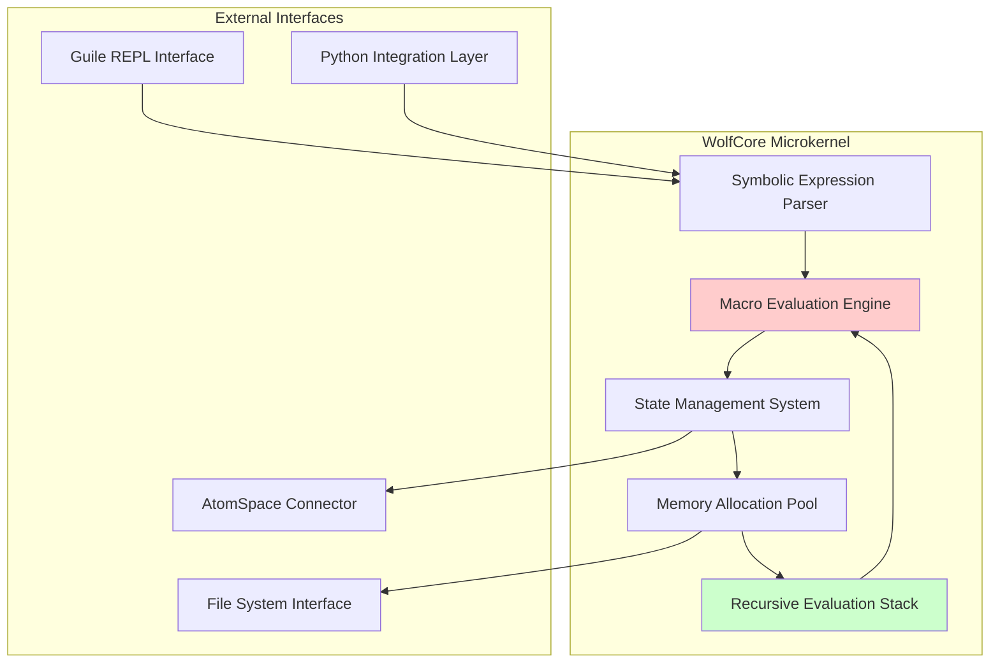

### Ecron Scheduler Cognitive Flow

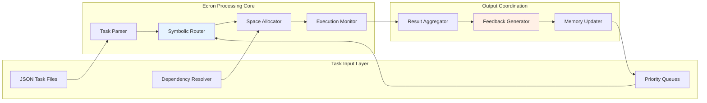

## ⟨OpenCog Integration Pathways⟩

### AtomSpace Memory Topology

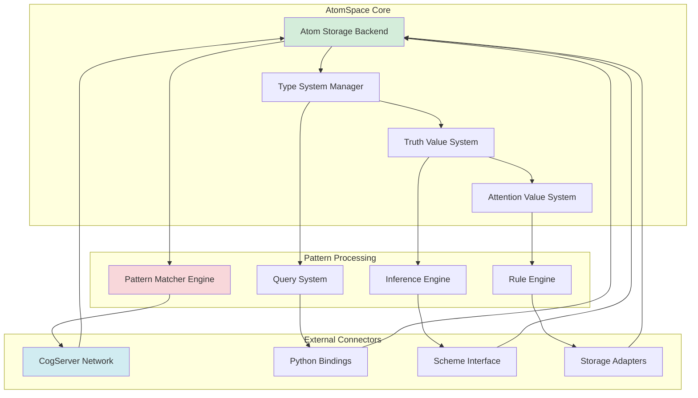

### CogServer Network Architecture

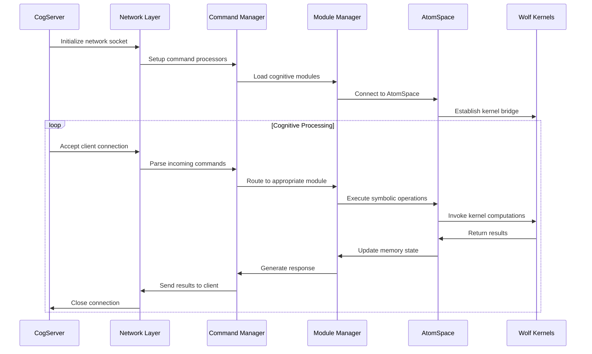

## ⟨Symbolic Spaces Detailed Topology⟩

### Inter-Space Communication Protocol

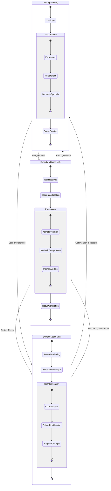

## ⟨Daemon System Coordination⟩

### Scheduler Daemon Flow Architecture

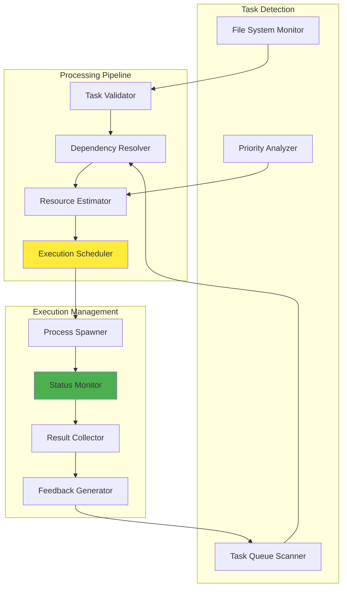

### Reflex Daemon Monitoring System

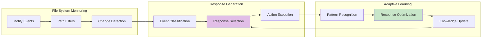

## ⟨Cognitive Agents Interaction Model⟩

### Admin Agent Cognitive Loop

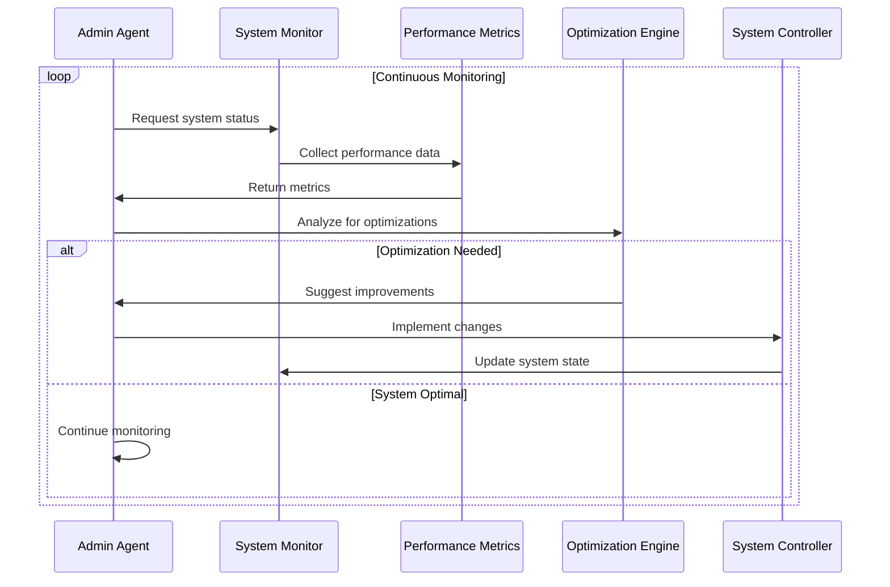

### Director Agent Reasoning Flow

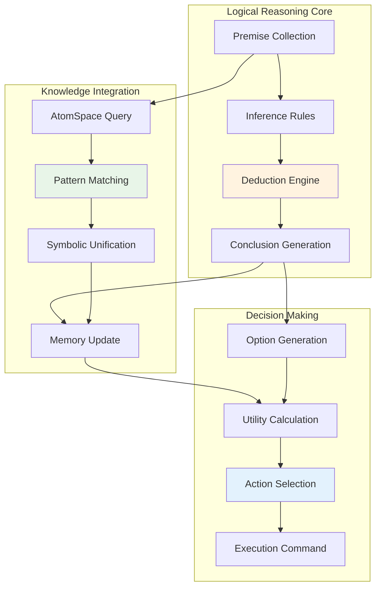

## ⟨Integration Layer Specifications⟩

### LibraryLinkUtils Bridge Architecture

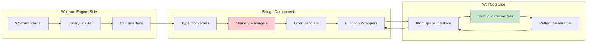

### GitLink Self-Modification Protocol

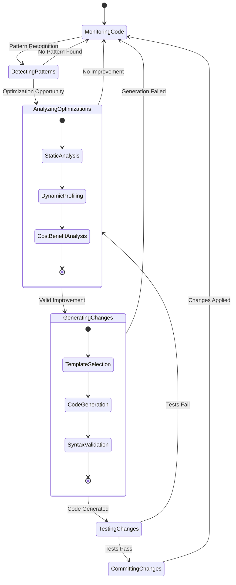

## ⟨Performance and Optimization Metrics⟩

### System Performance Dashboard

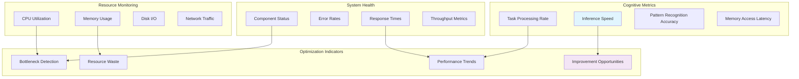

This component architecture documentation provides the detailed cognitive pathways and recursive implementation structures necessary for understanding the emergent patterns within the WolfCog AGI-OS ecosystem.