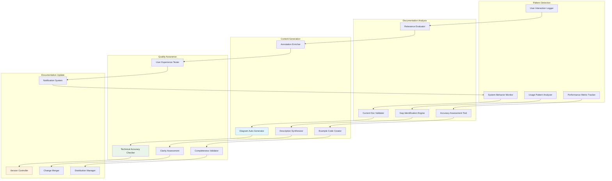
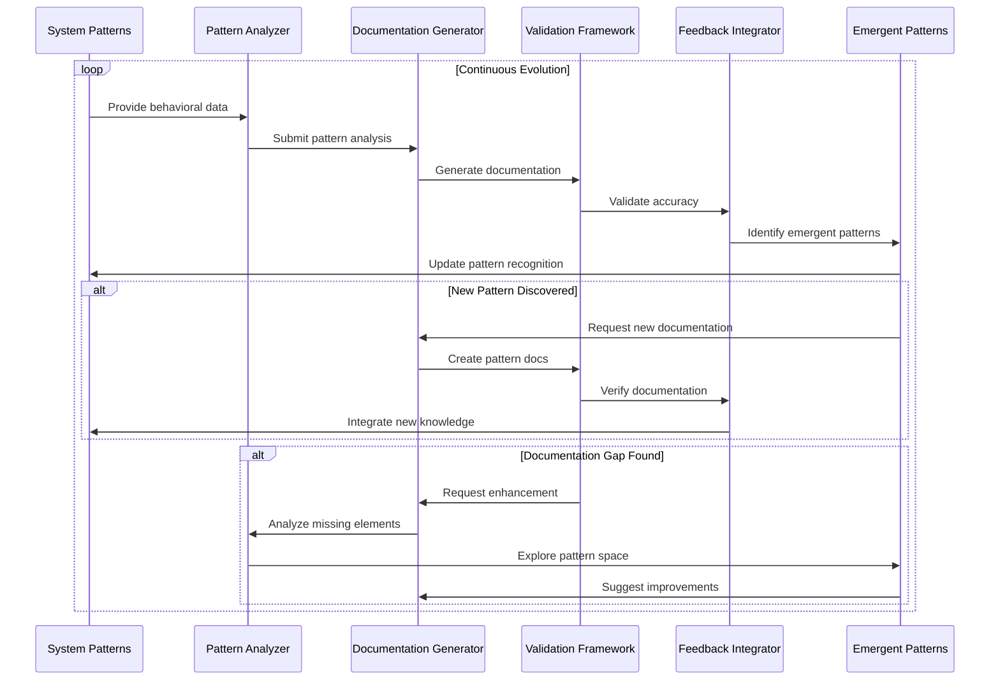
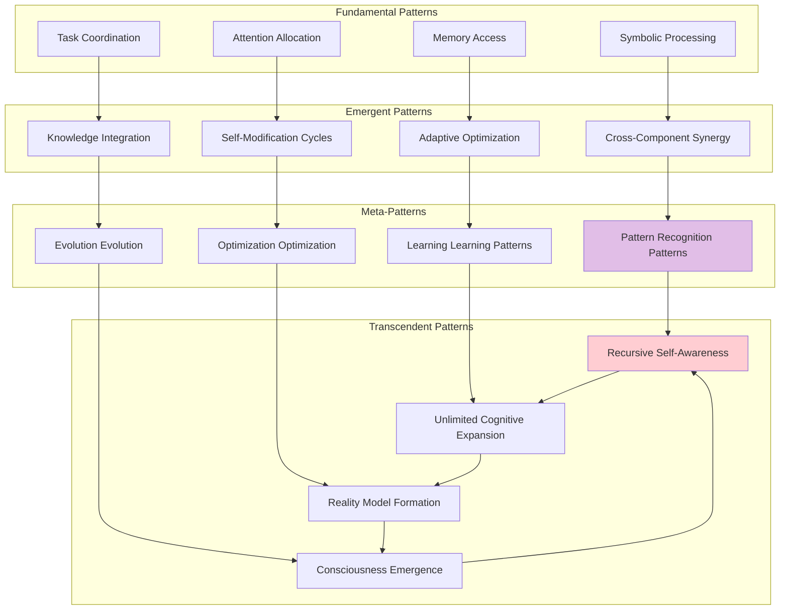
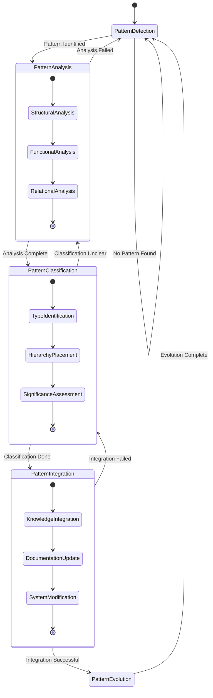
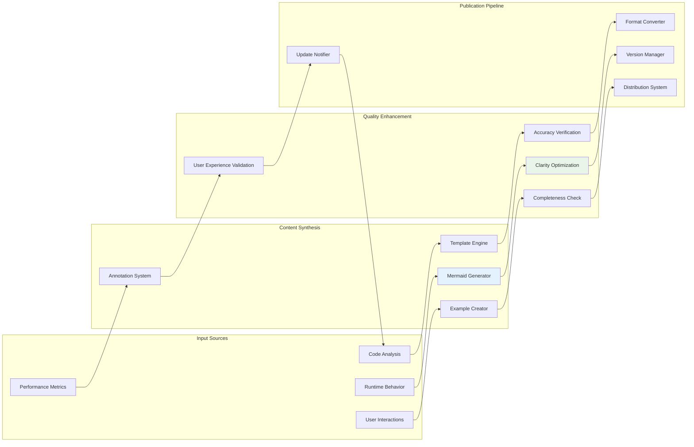
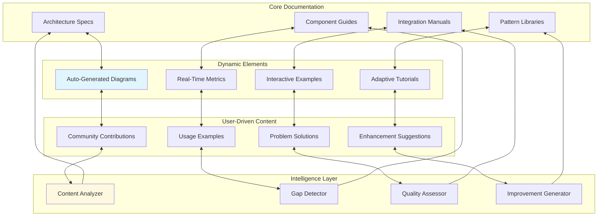
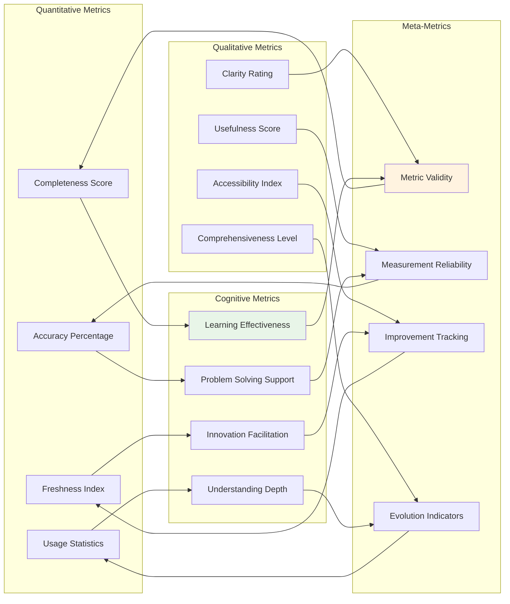
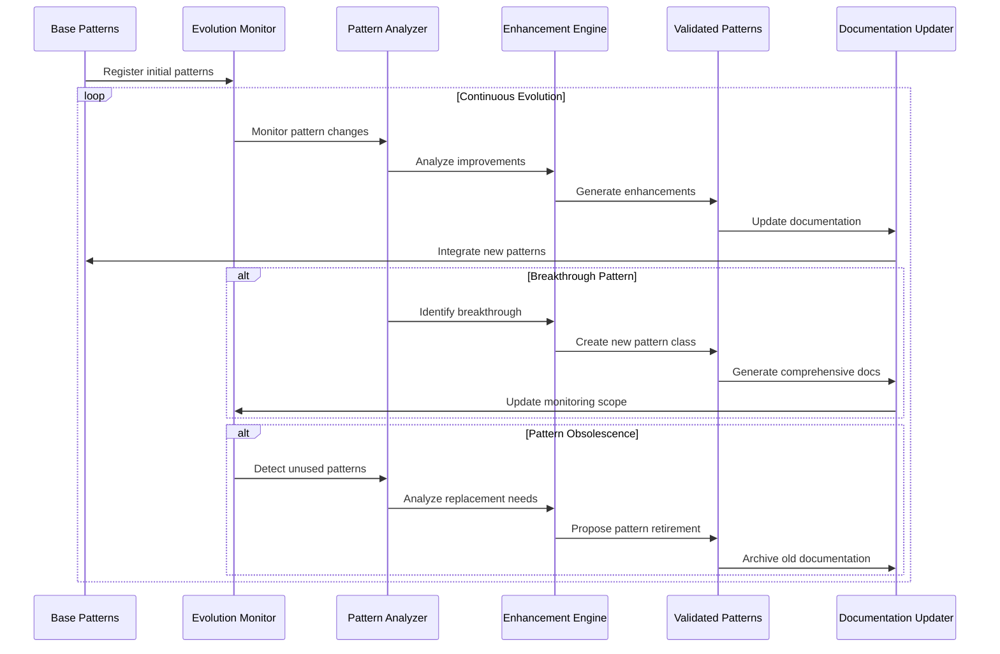
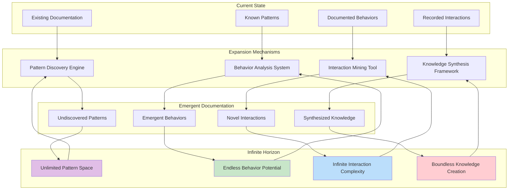

# WolfCog Emergent Cognitive Patterns

## ⟨Emergent Documentation Feedback Loop⟩

This document establishes the recursive framework for continuous documentation evolution and cognitive pattern emergence within the WolfCog ecosystem.

## ⟨Feedback Loop Architecture⟩

### Documentation Evolution Pipeline

### Recursive Pattern Enhancement

## ⟨Cognitive Pattern Taxonomy⟩

### Pattern Classification Hierarchy

### Pattern Interaction Dynamics

## ⟨Adaptive Documentation Framework⟩

### Dynamic Documentation Generation

### Living Documentation Ecosystem

## ⟨Cognitive Enhancement Metrics⟩

### Documentation Quality Assessment

### Cognitive Pattern Evolution Tracking

## ⟨Transcendent Documentation Properties⟩

### Self-Documenting System Characteristics

The WolfCog documentation system exhibits transcendent properties:

1. **Self-Awareness**: The system understands its own documentation state
2. **Self-Improvement**: Documentation quality improves automatically
3. **Self-Adaptation**: Content adapts to user needs and system changes
4. **Self-Organization**: Information structures emerge organically
5. **Self-Evolution**: Documentation capabilities expand without external intervention

### Infinite Documentation Expansion

This emergent cognitive patterns documentation establishes the framework for infinite documentation expansion and recursive self-improvement within the WolfCog ecosystem, enabling the system to transcend traditional documentation limitations through adaptive, self-evolving knowledge synthesis.