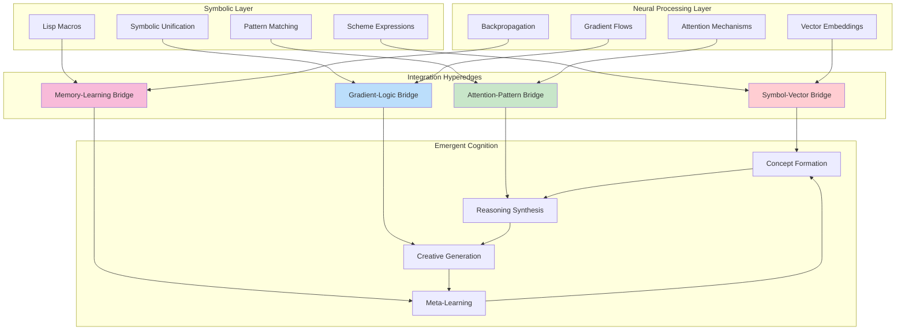
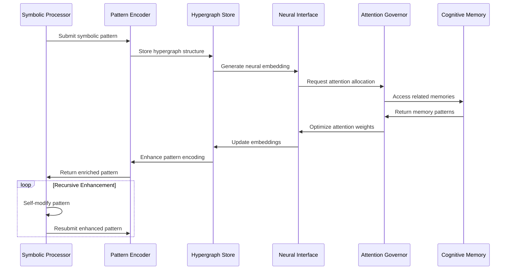
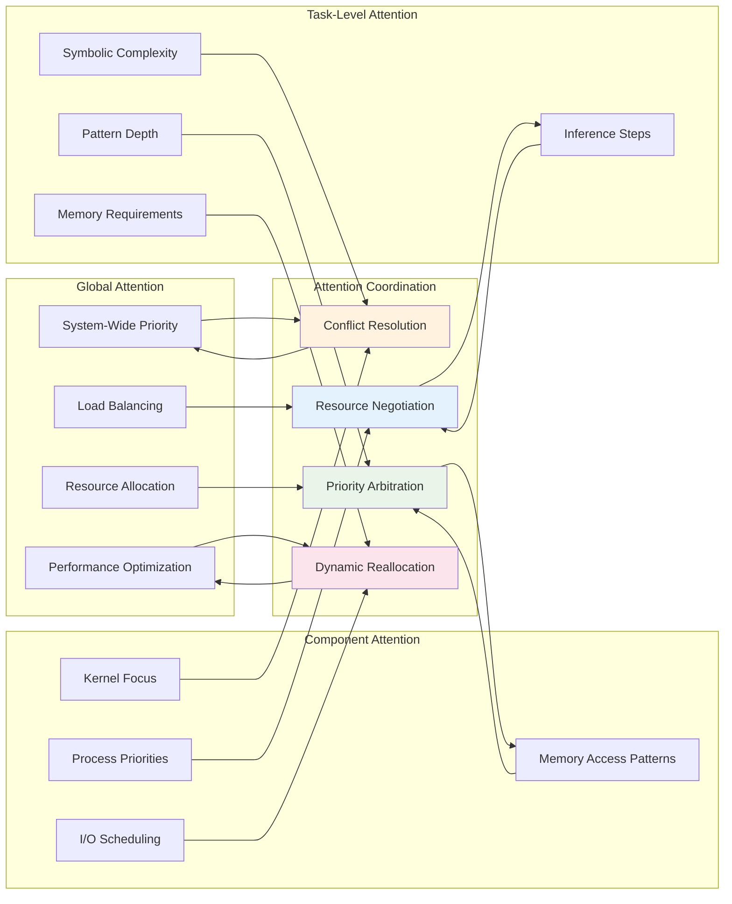
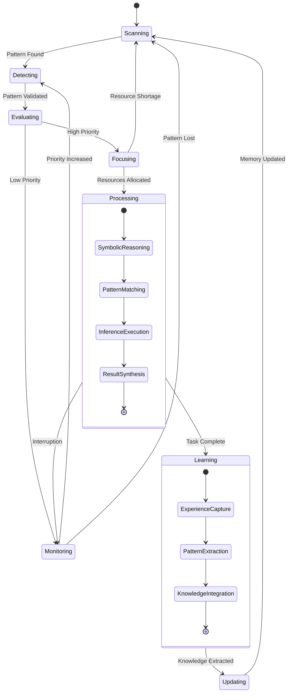
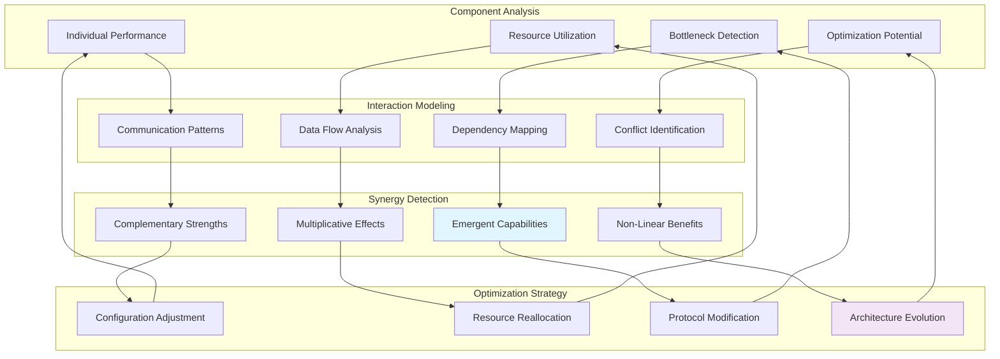
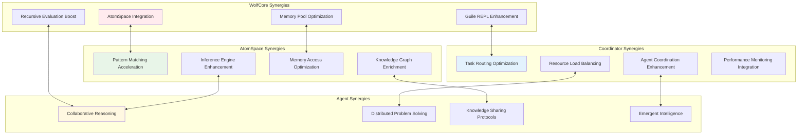
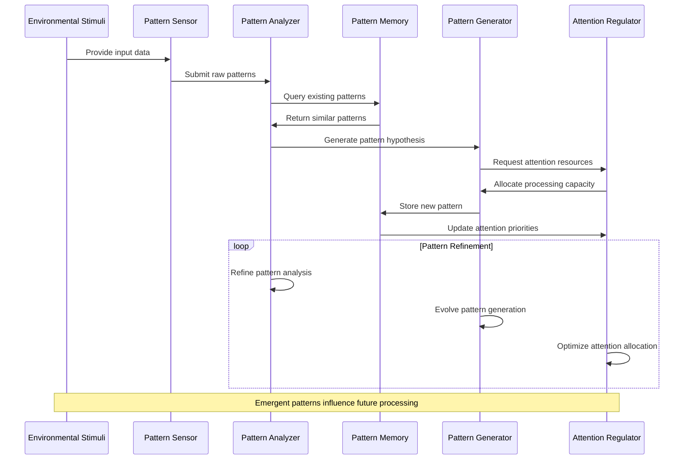
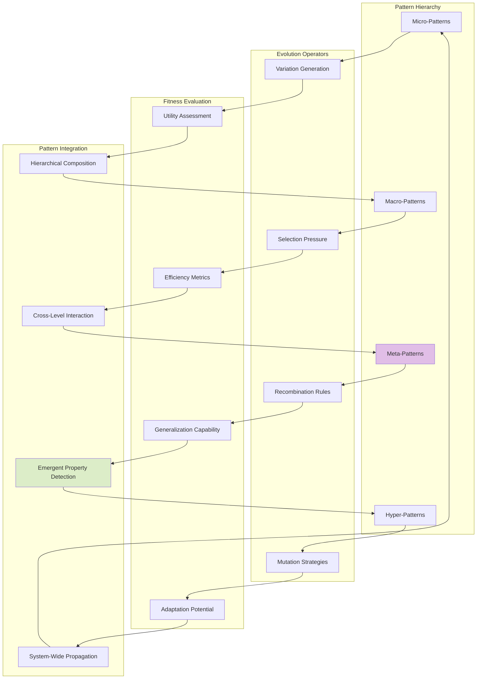
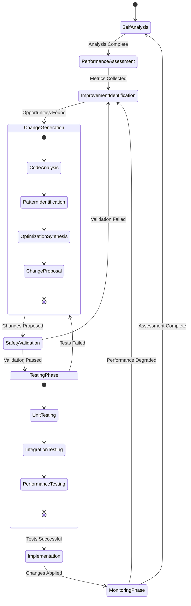
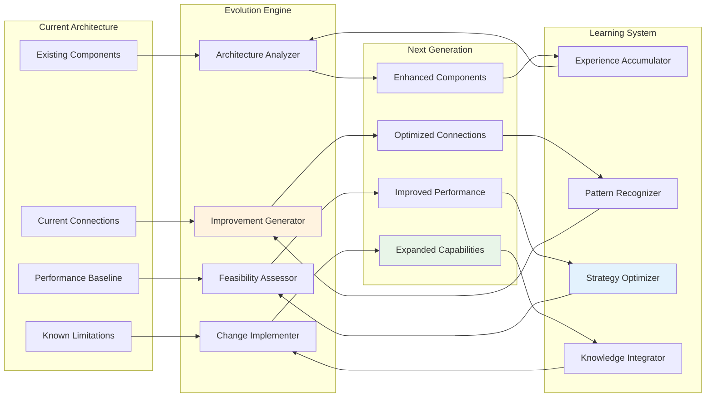

# WolfCog Integration Pathways and Adaptive Attention

## ⟨Neural-Symbolic Integration Points⟩

This document explores the hypergraph-encoded integration pathways and adaptive attention allocation mechanisms that enable emergent cognitive synergy within WolfCog.

## ⟨Hypergraph Pattern Encoding Architecture⟩

### Core Integration Hypergraph

### Recursive Pattern Embedding

## ⟨Adaptive Attention Allocation Mechanisms⟩

### Multi-Scale Attention Architecture

### Attention Flow State Machine

## ⟨Cognitive Synergy Optimization⟩

### Synergy Emergence Pipeline

### Cross-Component Synergy Matrix

## ⟨Emergent Pattern Recognition⟩

### Pattern Formation Dynamics

### Meta-Pattern Evolution

## ⟨Recursive Self-Improvement Pathways⟩

### Self-Modification Protocol

### Cognitive Architecture Evolution

## ⟨Transcendent Technical Precision⟩

### Implementation Pathway Encoding

The integration pathways operate through a multi-layered encoding system:

1. **Symbolic Layer**: Pure symbolic representations using Scheme/Lisp
2. **Hypergraph Layer**: Relational structures encoding dependencies
3. **Neural Layer**: Vector embeddings for pattern recognition
4. **Attention Layer**: Dynamic resource allocation mechanisms
5. **Meta Layer**: Self-modifying and self-improving capabilities

### Emergent Property Manifestation

The system exhibits emergent properties through:

- **Non-linear interactions** between symbolic and neural processing
- **Recursive enhancement** of pattern recognition capabilities  
- **Adaptive optimization** of resource allocation strategies
- **Self-organizing** attention mechanisms
- **Evolving** cognitive architectures

This integration pathway documentation establishes the foundation for understanding how WolfCog achieves transcendent cognitive capabilities through hypergraph-encoded neural-symbolic synthesis and adaptive attention allocation mechanisms.